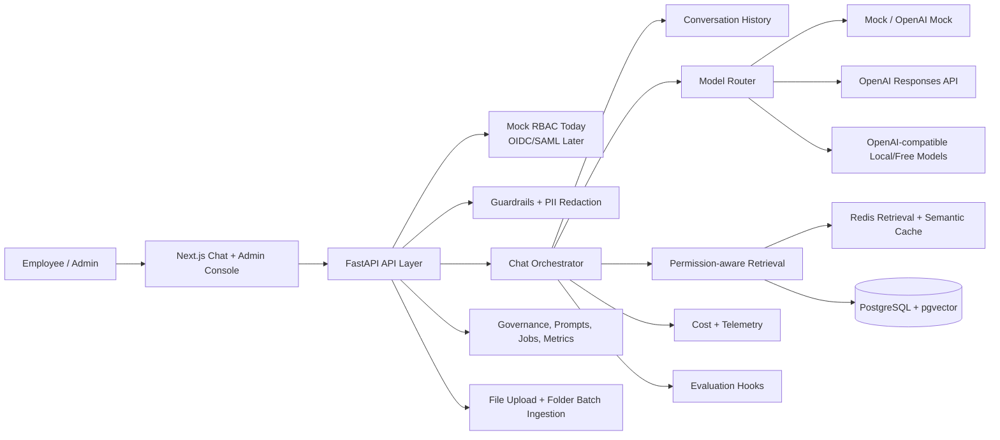
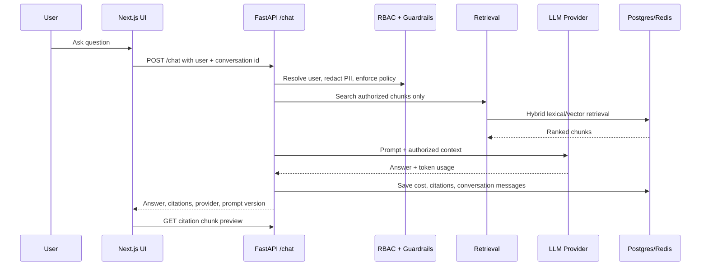
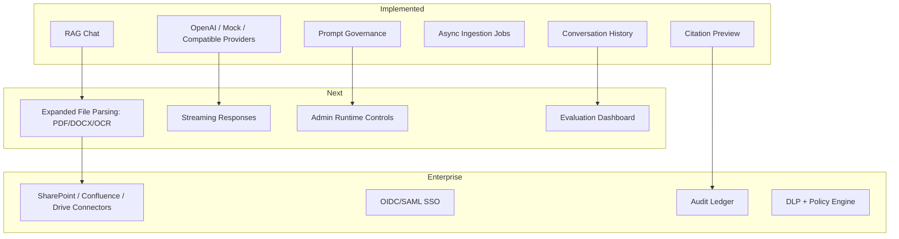

# Whiteboard Guide

Draw the system left to right.

## Product Architecture

## Chat Request Flow

## Module Roadmap

## 1. User and UI

Start with employees using a web chat UI. Show an admin page for usage metrics and knowledge operations.

## 2. API layer

Draw FastAPI with endpoints:

- `/chat`
- `/ingest`
- `/documents`
- `/evaluate`
- `/metrics/cost`

Mention SSO/API gateway in production, even though this skeleton uses mock RBAC.

## 3. Request path for chat

Draw:

User question -> auth context -> guardrails -> model router -> retrieval -> LLM provider -> evaluator/cost/logger -> response with citations.

Call out that document permissions are applied before chunks enter model context.

## 4. Knowledge ingestion path

Draw:

Connectors -> queue -> parser/chunker -> metadata extractor -> embeddings -> PostgreSQL/pgvector.

Mention source systems: SharePoint, Confluence, Jira, PDFs, internal KBs.

Current implementation supports:

- Admin file upload for `.txt`, `.md`, `.csv`, and `.json`
- Folder batch ingestion from the configured watch folder
- Redis-backed async folder ingestion jobs
- Docker host folder `data/ingest` mounted to `/app/watch`

## 5. Storage

Draw PostgreSQL for metadata, chunks, cost, evaluation, and audit records. Draw pgvector for embeddings and Redis for cache/queue/rate limits.

## 6. Observability and governance

Draw logs, metrics, traces, audit logs, and evaluation datasets as cross-cutting concerns.

## 7. Future agents

Draw a workflow/orchestration box above retrieval and LLM providers. Explain that agents reuse governed services rather than bypassing security controls.
